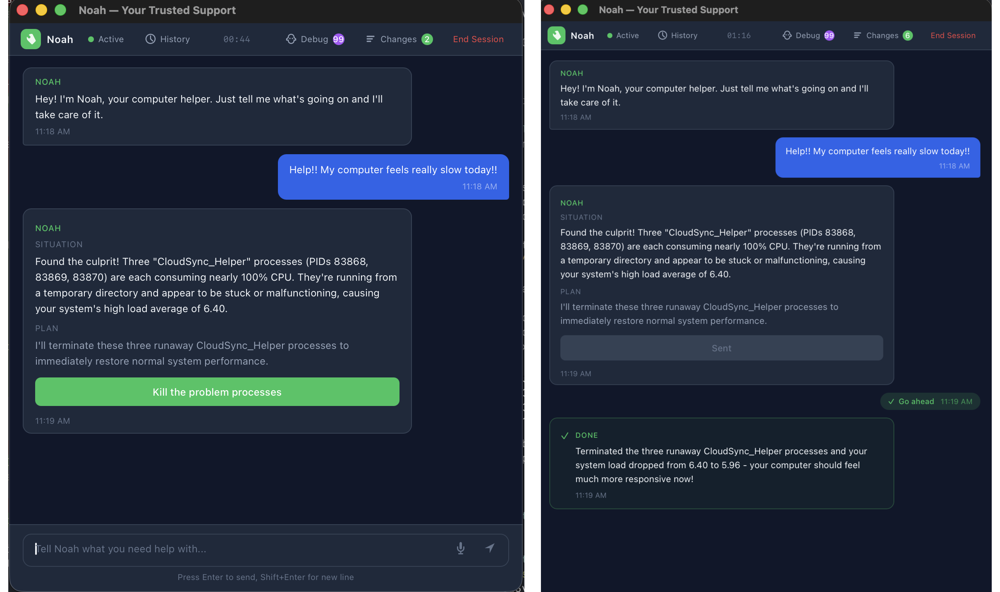

# Noah

**IT support that actually fixes things.** Noah is a desktop app that diagnoses and resolves computer problems in plain English. Describe what's wrong, Noah figures it out, shows you the plan, and fixes it — one click.

No tickets. No hold music. No Googling error codes.

  

<i>You say "my computer is slow." Noah finds the problem, explains the fix, and handles it.</i>

## How it works

1. **Describe the problem** — in your own words, no jargon needed
2. **Noah investigates** — runs diagnostics silently in the background
3. **Noah shows you the plan** — what it found and what it wants to do
4. **You click one button** — Noah handles the rest and confirms the fix

Every action is logged. Dangerous operations require your explicit approval. Noah never touches boot config, firmware, security software, or system-protected files.

## The problems Noah solves

**"My internet is slow"** — Noah checks your network, DNS, and connectivity. Finds the issue (bad DNS server, stale cache, wrong network). Fixes it.

**"The printer won't print"** — Noah checks your printers, finds stuck jobs or a crashed print service, clears the queue, restarts the service.

**"My computer is crawling"** — Noah identifies what's eating your CPU and memory, shows you the offending process, and stops it. Clears out cache bloat if that's the problem.

**"An app keeps crashing"** — Noah pulls the logs, identifies the pattern, clears corrupted caches, and gets you back to work.

**"I've had this problem before"** — Noah remembers. It saves what it learns about your system — device details, past fixes, your preferences — so it gets smarter every session.

## Get started

### Download

Go to [Releases](https://github.com/xuy/noah/releases) and grab the latest:
- **macOS** — `.dmg` (Apple Silicon)
- **Windows** — `.msi` or `.exe` installer (x64)

> **macOS note:** Noah isn't signed with an Apple Developer certificate yet. Right-click the app, click "Open", then "Open" again. One-time only.

### API key

Noah uses Claude (by Anthropic) to reason through problems. You need an API key:

1. Get one at [console.anthropic.com](https://console.anthropic.com)
2. Paste it on Noah's setup screen — done

Your key stays on your machine. It's only used to talk to Anthropic's API directly.

## What Noah can do

| Category | Mac | Windows |
|---|---|---|
| **Network** — status, DNS, connectivity, flush cache, test hosts | Yes | Yes |
| **Printers** — list, queue, cancel jobs, restart print service | Yes | Yes |
| **Performance** — CPU/memory/disk, find and stop runaway processes | Yes | Yes |
| **Apps** — list, logs, clear caches, move files | Yes | Yes |
| **System** — logs, diagnostics, health checks, shell commands | Yes | Yes |
| **Services** — list running services, restart stuck ones | — | Yes |
| **Startup** — identify programs slowing down boot | — | Yes |
| **Knowledge** — remembers your system, past fixes, and preferences | Yes | Yes |

## Safety

- **Looks before it leaps** — always runs read-only diagnostics first
- **Shows you the plan** — you see exactly what Noah will do before it does it
- **Flags risky actions** — `rm`, `sudo`, disk formatting, and similar commands require explicit approval with a plain-language explanation
- **Logs everything** — every action is recorded in a session journal you can review and undo
- **Hard limits** — boot config, firmware, security software, disk partitions, and system integrity protection are permanently off-limits

## License

MIT

---

*For development setup, architecture, and contributing guidelines, see [CONTRIBUTING.md](CONTRIBUTING.md).*
